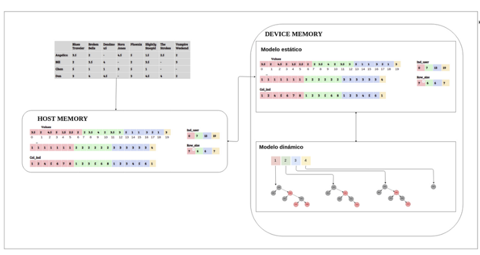

## Team recommender for MOBA games using collaborative filter (using LOL dataset)

We implemented a memory-based collaborative filtering algorithm on cuda to allow real time queries on big datasets.

Our proposal includes a sparse representation of the matrix of items, the use of red-black trees to allow instant data updates, as well as the use of the computational power of the GPU to make recommendations in real time.

For further details check the pdf of our report.